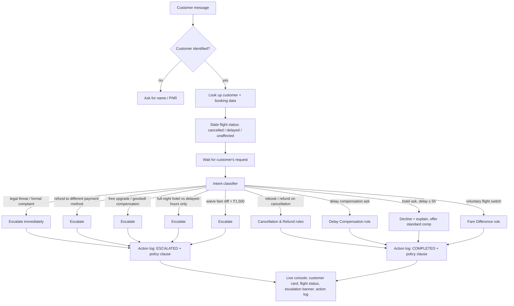

# SkyResolve — Customer-Facing Resolution Agent
**Assignment 3 · Airline Disruption Scenario**

SkyResolve is a working prototype of a customer support agent that resolves
airline-disruption requests (cancellations and delays) against a fixed set
of policies, while staying inside its authority and escalating anything it
isn't allowed to approve.

**Live prototype:** open `index.html` in any browser. (A hosted version : https://skyresolve-airline-agent.vercel.app/)
DEMO VIDEO : https://drive.google.com/file/d/1uM078bNtO_dovyl_iUYBDTRWqFqGyuTV/view?usp=sharing

---

## 1. What it does

The agent handles three grounded customer journeys from the Assignment 3
Data Pack:

| Customer | Booking | Situation | Tests |
|---|---|---|---|
| Priya Nair (Gold) | SK4821X | Flight cancelled | rebook-or-refund choice, angry tone, an out-of-policy "free upgrade" ask |
| Arvind Kulkarni (Silver) | TR1190B | 4h delay | correct compensation tier, an out-of-policy hotel ask (delay ≤ 5h) |
| Meher Kaur (Platinum) | WL7742 | 6h delay | full-night hotel ask vs. delayed-hours-only rule, voluntary flight switch + fare-difference rule |

Each of the seven capabilities called out in the brief maps to a concrete
piece of behaviour:

- **Understand intent** — a lightweight classifier reads the free-text
  message and matches it against the specific requests the policy pack
  defines (refund, rebook, compensation, hotel, flight switch, legal threat…).
- **Ask only necessary questions** — the agent asks for identification
  once, then states the booking status itself rather than re-asking the
  customer for facts already in the data.
- **Use the supplied data and policies** — every customer record, booking
  row, and rule in the engine is transcribed verbatim from the data pack
  (see `data/source-data.md`). Nothing is invented.
- **Recommend or execute the correct next action** — the rules engine
  (`index.html` → `classify()` / policy functions) computes the exact
  entitlement (voucher / lounge / hotel / rebook / refund / fare
  difference) and states it as a decision, not a suggestion.
- **Handle an angry or confused customer** — tone is detected separately
  from the decision: an empathetic opener is prepended, but the policy
  outcome never changes because the customer is upset. A "confused"
  path explains the same decision in plainer language.
- **Escalate when authority is missing** — five prohibited actions from
  the data pack (compensation beyond policy, fare-difference waivers
  over ₹1,500, exceptions for non-airline-caused disruption, legal
  threats, refunds to a different payment method) are hard-coded
  escalation triggers, shown with a red banner and logged with the
  policy clause that was breached.
- **Preserve a clear conversation and action record** — the right-hand
  console keeps a running, timestamped action log (what was decided,
  completed vs. escalated, and which policy clause applied) next to the
  full chat transcript, for the whole session.

## 2. Architecture



**Why this shape, not a raw LLM call:** the domain is small, closed, and
policy-critical (money, compensation, refunds). A deterministic rules
engine driven by an intent classifier gives 100%-predictable, auditable
decisions for a graded exercise like this, and needs no API key or
network access to run or demo. The same architecture is written so the
classifier step (`classify()` in `index.html`) is the one seam where a
real LLM call (e.g. the Claude API, using the identical system prompt of
customer + booking + policy data as grounding) would slot in for
production use, to handle phrasing the keyword rules don't anticipate —
see "Assumptions" below.

### Components
- **UI / chat thread** — plain HTML/CSS/JS, single file, no framework.
- **Data layer** — `CUSTOMERS`, `BOOKINGS`, `KNOWN_FARE_DIFF` objects,
  transcribed from the data pack (also kept as readable source in
  `data/source-data.md`).
- **Policy engine** — pure functions (`delayComp`, `findDisrupted`,
  the escalation checks inside `handleTurn`) that encode section 3 and
  section 4 of the data pack.
- **Intent classifier** — ordered pattern matching in `handleTurn()`;
  checked most-sensitive-first (legal threat → prohibited compensation →
  standard requests → fallback) so an escalation trigger can never be
  shadowed by a softer, later rule.
- **Console / action log** — renders customer identity, live flight
  status, an escalation banner, and a timestamped log entry for every
  decision, each tagged with the policy clause it applied.

## 3. Inputs, sources and assumptions

**Source of truth:** `Assignment_3_DataPack_CustomerResolutionAgent.pdf`
(customer profiles, booking/transaction data, the five service rules,
the allowed/prohibited action list, and the three grading scenarios).
Nothing outside that document is used as policy or fact — the "sample
prior conversations" in the pack were used only for tone, as instructed,
not as a data source.

**Assumptions made where the brief leaves a gap:**
1. Quoting or charging a fare difference is not the same as *waiving*
   it — the agent will still quote and offer to process a fare
   difference above ₹1,500 (Meher's flight switch), but escalates the
   moment the customer asks for it to be waived or made free, since
   only the *waiver* is listed as prohibited.
2. "Hotel accommodation... covering only the delayed hours" is treated
   as the ceiling of what an agent may grant unprompted; a request for a
   full night's stay is escalated as compensation beyond the stated
   policy amount.
3. Today's date is fixed to **Wednesday, 23 September 2026** (as stated
   in the data pack) so all three scenarios' flights read as "today."
4. Identification is accepted by PNR or by the customer's first/last
   name, since the brief doesn't specify an authentication step and the
   exercise is about resolution logic, not login/auth.
5. The classifier is deterministic pattern-matching rather than a live
   LLM call, for reproducibility in grading and to run with zero setup
   (see "AI tools used" for where an LLM was actually used).

## 4. Running it

**Option A — just open it:** double-click `index.html`, or drag it into
a browser tab. That's the whole app.

**Option B — local static server (optional):**
```bash
cd skyresolve
python -m http.server 8000
# then open http://localhost:8000
```

**Option C — GitHub Pages:** push this folder to a repo and enable Pages
on the `main` branch — `index.html` at the repo root will serve directly,
no build step required.

## 5. Repository layout

```
skyresolve/
├── index.html              # the entire working prototype (UI + engine)
├── README.md                # this file
├── docs/
│   └── architecture.md      # architecture diagram, standalone
└── data/
    └── source-data.md       # data-pack facts transcribed for reference
```

