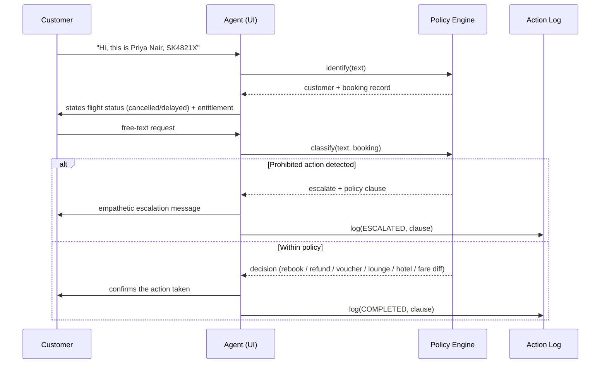

# Architecture & Process Flow — SkyResolve

## Layers

1. **Presentation layer** — chat thread (left) + live agent console (right),
   plain HTML/CSS in `index.html`. No framework, no build step.
2. **Data layer** — `CUSTOMERS`, `BOOKINGS`, `KNOWN_FARE_DIFF` constants in
   `index.html`, transcribed verbatim from the Assignment 3 Data Pack.
   Mirrored in readable form in `data/source-data.md`.
3. **Policy / rules engine** — pure JS functions that encode the data
   pack's five service rules and the allowed/prohibited action list:
   - `delayComp(hours)` → Delay Compensation Rule
   - cancellation branch of `greetAfterIdentify()` → Cancellation
     Rebooking Rule + Refund Processing Rule
   - fare-difference branch of `handleTurn()` → Fare Difference Rule
   - five escalation checks in `handleTurn()` → the five prohibited
     actions
4. **Intent classifier** — ordered pattern-matching inside `handleTurn()`.
   Order matters: checks run most-sensitive-first so a prohibited
   request can't be accidentally satisfied by a more generic rule later
   in the chain.
5. **Session state & logging** — `state.customer`, `state.booking`,
   `state.log[]`; every decision (completed or escalated) is appended
   with a timestamp and the policy clause that produced it, and rendered
   live in the console.

## End-to-end flow

## Escalation triggers (from the data pack's "Prohibited" list)

| Trigger | Detection | Policy clause |
|---|---|---|
| Legal action / formal complaint | keyword match (`lawyer`, `sue`, `legal action`, `formal complaint`, …) | "Handling threats of legal action or formal complaints — must be escalated immediately" |
| Refund to a different payment method | `refund` + `different card/account` etc. | "Processing refunds to a different payment method than the original" |
| Free upgrade / goodwill compensation | `business class`, `free upgrade`, "for the trouble" + upgrade | "Approving any compensation beyond the stated policy amounts" |
| Full-night hotel vs. delayed-hours-only | `hotel`/`accommodation` + `full night`/`entire night` | "Approving any compensation beyond the stated policy amounts" |
| Waiving fare difference > ₹1,500 | flight-switch request + `waive`/`for free`/`no charge` | "Waiving a fare difference above ₹1,500" |

## Why deterministic rules instead of a live model call

The domain is small, closed, and money-bearing. A rules engine driven by
an intent classifier gives fully predictable, auditable decisions with
no network dependency — appropriate for a graded exercise and for a
regulated, compensation-issuing workflow. The classifier step is the one
seam designed so a real LLM call could be substituted later (e.g. the
Claude API, given the same customer + booking + policy data as a system
prompt) to generalise beyond the keyword patterns here.